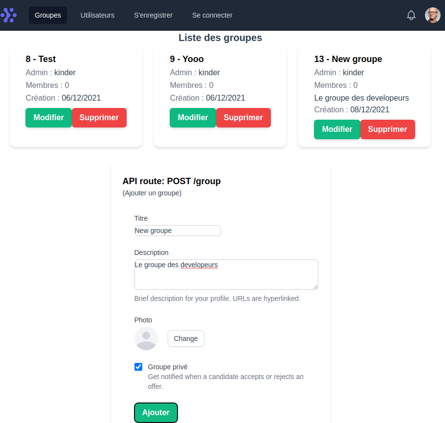

# POC NodeJS

Créer une application permettant aux utilisateurs de se connecter est de visualiser la liste des utilisateurs et des groupes.
Les utilisateurs peuvent renseigner des informations sur leur profil et rejoindre des groupes.



## Project setup
```
npm install
```

### Compiles and hot-reloads VueJS for development
```
npm run dev
```

## Analyse du projet

Ce que l'application doit faire :

* Lister des utilisateurs
* Lister des groupes
* Afficher les detail d'un utilisateur
* Afficher les détail d'un groupe
* CRUD utilisateurs
* CRUD groupe
* Gestion des utilisateurs (auth, inscription, déconnexion)

## MCD

## Use Cases

## User Stories

|En tant que |Je veux pouvoir| Dans le but de|
|---|---|---|
|Visiteur| Afficher le site | Voir la liste des groupes |
|Visiteur| Créer un compte | Accéder au site et aux fonctionnalités|
|Utilisateur| Me connecter | Consulter le site et accès aux fonctionnalités|
|Utilisateur| Me déconnecter | Quitter le site|
|Utilisateur| Supprimer le compte | Supprimer le compte et les groupes associés en tant qu'admin de groupe, dissocié des autres groupes|
|Utilisateur| Créer un groupe | Ajouter un groupe au site|
|Utilisateur| Afficher les groupes | Consulter un groupe|
|Utilisateur| Candidater dans un groupe | Envoyer une candidateure pour intégrer un groupe|
|Admin de groupe| Modifier un groupe | Modifier les infos d'un groupe du site|
|Admin de groupe| Supprimer un groupe | Supprimer un groupe du site et les messages associés|
|Admin de groupe| Associer des utilisateurs | Constituer des listes de membres appartenant au groupe|
|Admin de groupe| Associer un role | Donner le role "modérateur" à un/des membres appartenant au groupe|
|Admin de groupe| Dissocier un membre | Retirer un membre associé au groupe|
|Admin de groupe| Dissocier un role | Retirer le role "modérateur" à un/des membres appartenant au groupe|
|Modérateur| Dissocier un membre | Retirer un membre associé au groupe|
|Membre de groupe| Afficher les messages | Consulter les messages d'un groupe auquel le membre appartient|
|Membre de groupe| Afficher les messages | Consulter les messages d'un groupe auquel le membre appartient|
|Membre de groupe| Créer un message | Ajouter un message dans d'un groupe auquel le membre appartient|
|...|...|...|

## Arborescence

* Accueil
  * Groupes
  * Mon profil
  

## Wireframes

https://www.figma.com/

## Spécificités
* Créer un formulaire multi-step d'inscription
* Créer une API
* Créer un front en VueJS